# 🦸‍♂️ Compose DRF 🦸‍♀️

Welcome to **Compose DRF**! This app is a basic implementation of **Django Rest Framework** for managing person records, built with **Jetpack Compose** for the UI and powered by **Retrofit** for network communication.

## 🌈 Features

- **Data Management**: Perform basic create, read, update, and delete (CRUD) operations on person records.
- **Jetpack Compose UI**: A clean and modern interface designed with Jetpack Compose and Material 3.
- **Django Rest Framework**: Utilizes DRF for a straightforward and efficient backend.
- **Retrofit Integration**: Simplifies API calls and data handling.
- **Light and Dark Themes**: Fully supports both themes for a personalized user experience.

## ⚙️ Tech Stack

- **Jetpack Compose**: Modern toolkit for building native UI.
- **Material 3**: Beautiful design components for a sleek look.
- **Django Rest Framework**: Powerful toolkit for building Web APIs.
- **Retrofit**: Type-safe HTTP client for Android.

## 🌍 API

This app uses a Django Rest Framework backend for fetching and managing data. Ensure your backend is running and your computer [server] and mobile phone [where-you-test-the-app] is connected on the same network to use the app effectively.

## 📦 Setup

1.  **Clone the repository**:
    ```bash
    git clone https://github.com/ralphmarondev/compose-drf.git
    ```
2.  **Open the project** in Android Studio.

3.  **Get your local IP address**:

    - Open a command prompt on your Windows machine.
    - Type the following command and press Enter:
      ```bash
      ipconfig
      ```
    - Look for the IPv4 address (usually under the "Ethernet adapter" or "Wireless LAN adapter" section). It will look something like `192.168.68.124`.

4.  **Change the base URL**:

    - Open the file where you define your base URL `app/src/main/java/com/ralphmarondev/composedrf/data/RetrofitInstance.kt`.
    - Replace the following line:
      ```kotlin
      # change the `192.168.68.124` with your own ip address
      private const val BASE_URL = "http://192.168.68.124:8000/"
      ```
    - Update the IP address to match the one you found in the previous step.

5.  **Update allowed hosts**:

    - In your Django project's `settings.py`, ensure you have added the IP address to the `ALLOWED_HOSTS` list:
      ```python
      ALLOWED_HOSTS = ['192.168.68.124', 'localhost']
      ```

6.  **Set up PostgreSQL database**:

    a. **Install PostgreSQL**:

    - Download and install PostgreSQL from [here](https://www.postgresql.org/download/).

    b. **Open pgAdmin**:

    - Open pgAdmin to manage your PostgreSQL database.

    c. **Create a new database**:

    1. In pgAdmin, right-click on "Databases" and select **Create > Database**.
    2. Name your database ( `compose_drf`).
    3. Click **Save**.

    d. **Update Django settings**:

    - In the `settings.py` file of your Django project, update the database configuration to connect to your PostgreSQL instance:

      ```python

      DATABASES = {
        'default': {
        'ENGINE': 'django.db.backends.postgresql',
        'NAME': 'compose_drf',
        'USER': 'your-username', # your PostgreSQL username
        'PASSWORD': 'your-password', # your PostgreSQL password
        'HOST': 'localhost',
        'PORT': '5432',
        }
      }
      ```

7.  **Install the required Python packages**:

- In your terminal, navigate to your backend directory and install the project dependencies:

  ```bash
  cd drf-api
  python -m venv .venv
  source .venv/Scripts/activate
  pip install -r requirements.txt
  ```

8. **Apply migrations**:

- Now that the requirements are installed, you can set up the database tables:
  ```bash
  python manage.py makemigrations
  python manage.py migrate
  ```

9. **Run the Django backend**:

- Start the backend server to handle API requests, so as allowing request from different ip address on your network:
- I made a script to make this task easier:
  ```bash
  sh run.sh
  ```

10. **Run the app** on your emulator or device!

## 💖 Contributing

Contributions are welcome! If you have ideas for features or improvements, feel free to open an issue or submit a pull request. Let’s make Compose DRF even better together!

## 📸 Screenshots

<table>
  <tr>
    <td>
    <p>No Data Found</p>
    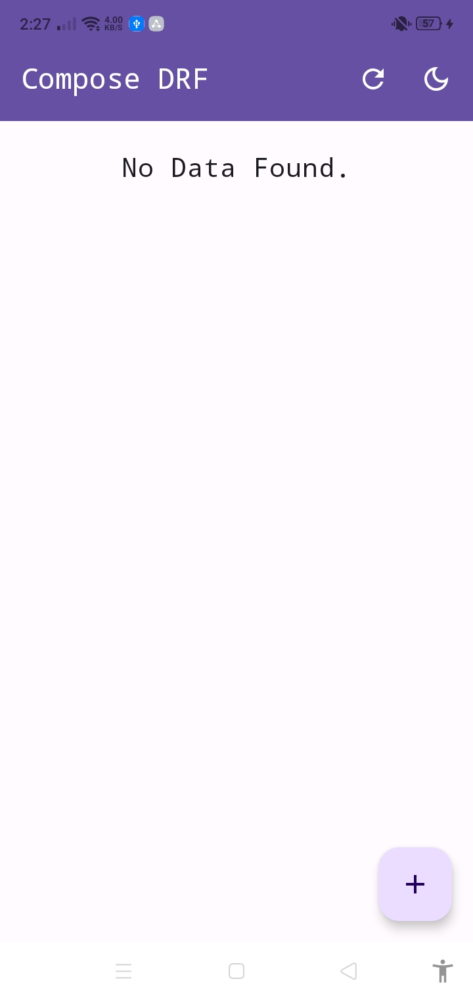</td>
    <td>
    <p>Add New Person</p>
    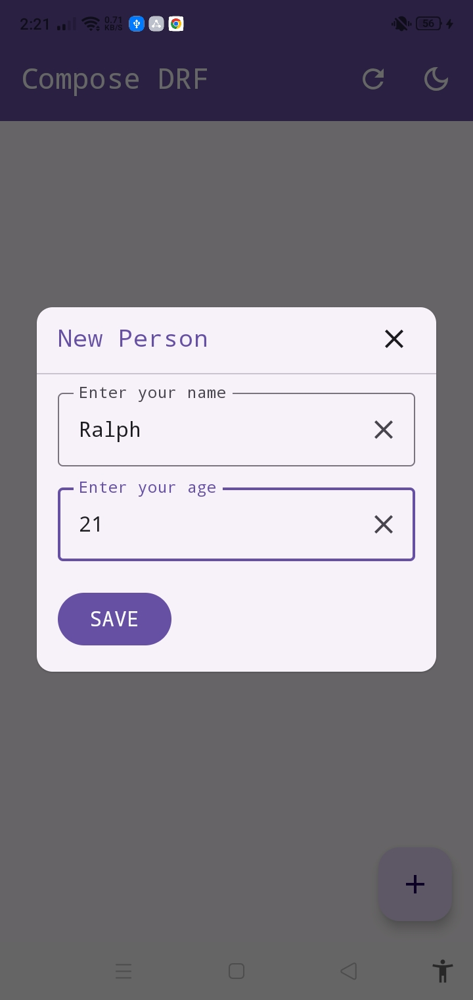</td>
  </tr>
  <tr>
    <td>
    <p>Update Person</p>
    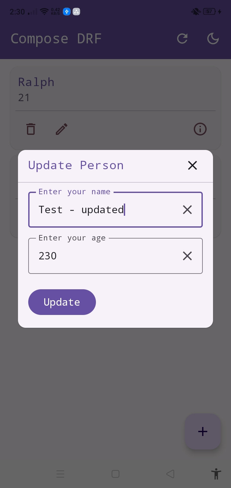
    </td>
    <td>
    <p>Updated Response</p>
    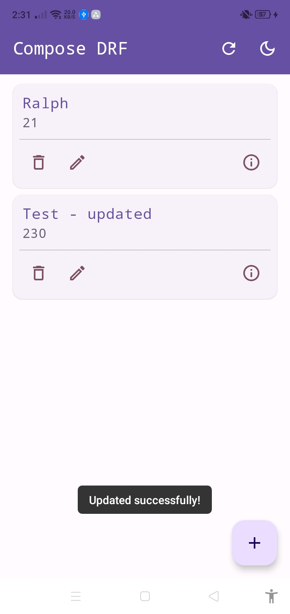
    </td>
  </tr>
  <tr>
    <td>
    <p>Delete</p>
    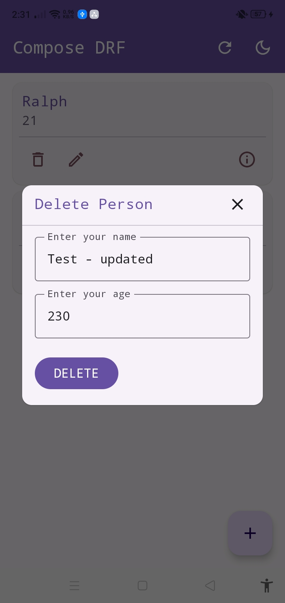
    </td>
    <td>
    <p>Deleted Response</p>
    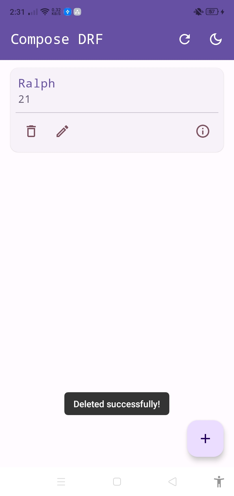
    </td>
  </tr>
  <tr>
    <td>
    <p>View Light</p>
    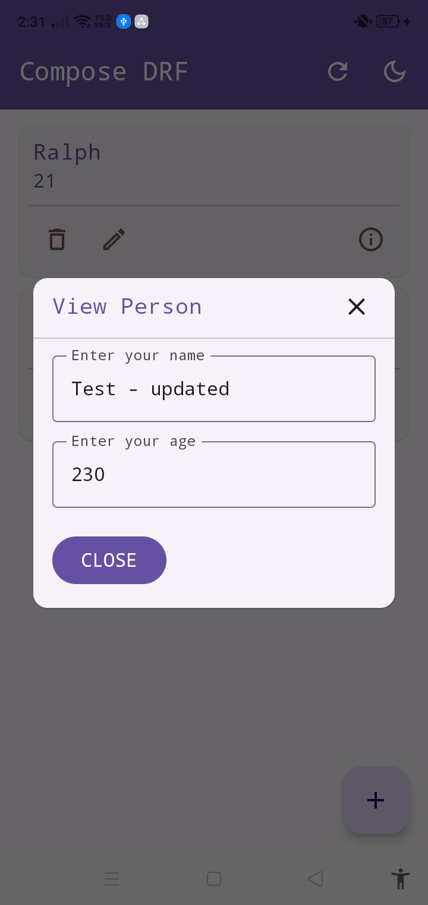
    </td>
    <td>
    <p>View Dark</p>
    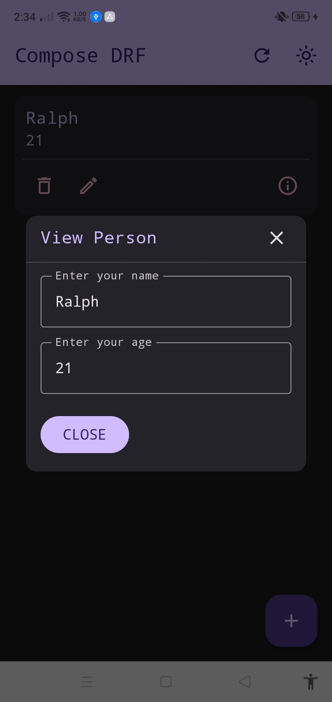
    </td>
  </tr>
  <tr>
    <td>
    <p>New Person Dark</p>
    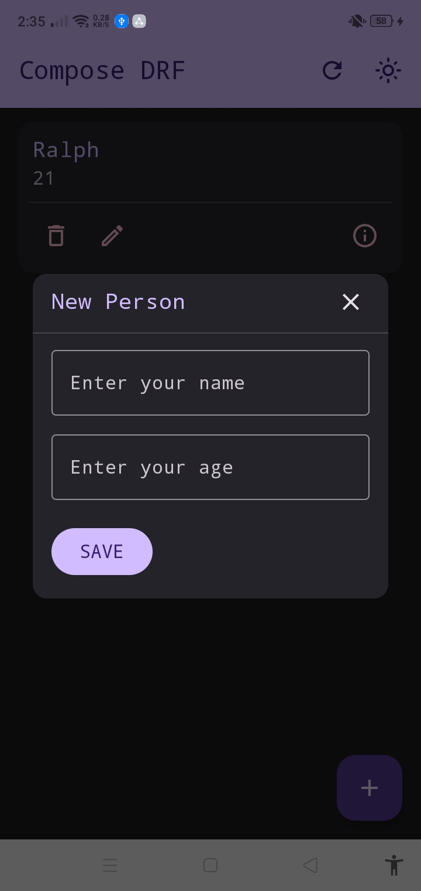
    </td>
    <td>
    <p>Update Person Dark</p>
    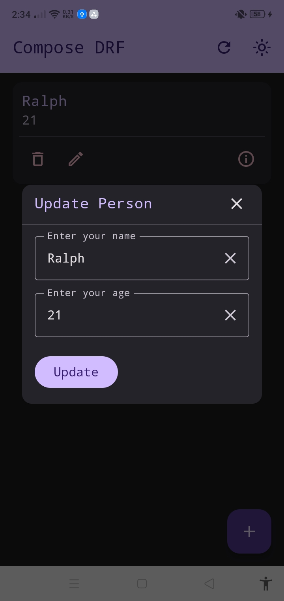
    </td>
  </tr>
  <tr>
    <td>
    <p>Delete Person Dark</p>
    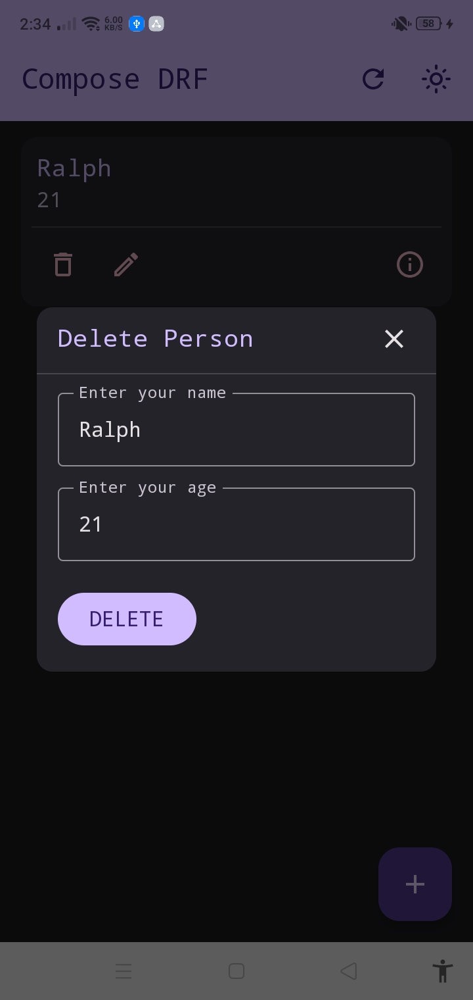
    </td>
    <td>
    <p>Home Dark</p>
    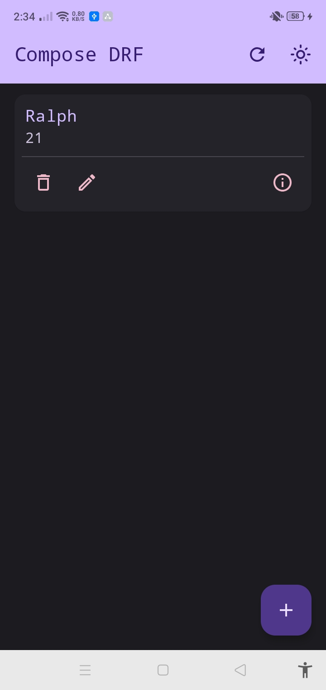
    </td>
  </tr>
</table>

## 🙌 Acknowledgements

Big shoutout to the creators of [Django Rest Framework](https://www.django-rest-framework.org/) for their amazing toolkit!

## 📄 License

This project is licensed under the MIT License. See the [LICENSE](LICENSE.txt) file for details.

## 📧 Contact

If you have any questions or suggestions, feel free to reach out to me at [edaralphmaron@gmail.com](mailto:edaralphmaron@gmail.com).
